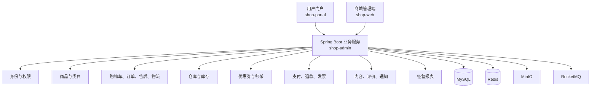

# Henfon Shop

> 一个包含商城管理端、用户门户和模块化后端的电商业务系统。


## 项目亮点

| 模块化单体 | 双端协同 | 交易闭环 | 可本地编排 |
| --- | --- | --- | --- |
| 后端按领域拆分，保持单体部署的开发效率 | 管理端与用户门户共享统一业务服务 | 覆盖商品、下单、支付、库存、售后、物流与营销 | Docker Compose 一次启动应用与基础设施 |

## 快速导航

| 我想了解 | 建议阅读 |
| --- | --- |
| 项目由哪些部分组成 | [项目概览](#项目概览) / [项目结构](#项目结构) |
| 已有哪些业务能力 | [功能模块](#功能模块) |
| 如何在本地启动 | [快速开始](#快速开始) |
| 前后端如何协作 | [系统架构](#系统架构) / [双端说明](#双端说明) |
| 接口、部署和上线要求 | [项目文档](#项目文档) / [常见问题](#常见问题) |

## 项目概览

Henfon Shop 面向通用电商场景，将商品展示、会员认证、购物车、订单履约、支付退款、库存管理和运营分析组织在同一套系统中。

| 维度 | 说明 |
| --- | --- |
| 系统定位 | 面向消费者购物与后台运营管理的全流程商城系统 |
| 终端组成 | `shop-portal` 用户门户、`shop-web` 管理端、`shop-admin` 统一业务后端 |
| 使用角色 | 访客、会员、商品运营、仓储人员、客服、财务和系统管理员 |
| 核心链路 | 商品浏览 -> 加入购物车 -> 提交订单 -> 支付 -> 发货物流 -> 确认收货 / 售后 |
| 架构形态 | Spring Boot 模块化单体，按业务领域拆分 Maven 模块，并通过 REST API 对外提供能力 |

## 系统架构



后端管理接口统一以 `/api/admin` 开头，用户门户接口统一以 `/api/portal` 开头。完整字段、错误码和接口约定见 [API 契约](docs/API契约.md)。

## 项目结构

```text
henfon-shop
├─ shop-admin/                         # Java 21 / Spring Boot 后端
│  ├─ shop-common/                     # 通用模型、异常、工具和基础设施
│  ├─ shop-identity/                   # 管理员、会员、认证、RBAC、审计
│  ├─ shop-catalog/                    # 商品、SKU、类目和商品内容
│  ├─ shop-trade/                      # 购物车、订单、售后、物流和 Outbox
│  ├─ shop-inventory/                  # 仓库、库存、供应商和盘点
│  ├─ shop-marketing/                  # 优惠券与秒杀
│  ├─ shop-payment/                    # 支付、退款、发票与资金对账
│  ├─ shop-content/                    # 轮播图、评价和站内通知
│  ├─ shop-reporting/                  # 销售、商品和会员经营分析
│  ├─ shop-integration/                # 快递、对象存储等外部集成
│  ├─ shop-boot/                       # Spring Boot 启动模块
│  └─ db/                              # 数据库初始化与迁移校验脚本
├─ shop-web/                           # React 管理端
├─ shop-portal/                        # React 用户门户
├─ docs/                                # 接口、部署、开发与上线文档
├─ docker-compose.yml                   # 本地完整环境编排
└─ .env.example                        # Docker 环境变量示例
```

## 技术栈

| 范畴 | 技术 |
| --- | --- |
| 后端 | Java 21、Spring Boot 3.4.5、MyBatis-Plus、JWT |
| 前端 | React 19、TypeScript、Vite、Tailwind CSS、Lucide、Recharts |
| 数据与缓存 | MySQL 8.4、Redis 7 |
| 异步与文件 | RocketMQ 5、MinIO |
| 构建与部署 | Maven、npm、Docker Compose |

## 功能模块

| 领域 | 已覆盖能力 |
| --- | --- |
| 身份与权限 | 管理员登录、会员注册登录、令牌刷新、RBAC、数据权限、登录与操作审计 |
| 商品中心 | 商品、SKU、类目、商品详情、内容审核与批量上下架 |
| 交易中心 | 购物车、订单创建、订单审核、发货、物流查询、订单备注与售后申请 |
| 库存供应 | 多仓库存、预占与释放、库存预警、供应商和库存盘点 |
| 营销运营 | 优惠券领取与核销、秒杀活动、轮播图和评价管理 |
| 支付财务 | 支付单、微信支付接入、退款、发票和资金对账 |
| 会员内容 | 会员资料、地址、收藏、商品对比记录、评价和站内通知 |
| 数据分析 | 销售趋势、商品排行、会员分析与 CSV 报表导出 |

## 环境要求

| 环境 | 版本或建议 | 用途 |
| --- | --- | --- |
| JDK | 21 | 后端编译与运行 |
| Maven | 3.8+ | 后端构建与测试 |
| Node.js | 18+，建议当前 LTS | 两个前端的开发与构建 |
| Docker Desktop | 最新稳定版 | 推荐，用于本地完整依赖环境 |
| MySQL | 8.x | 业务数据存储 |
| Redis | 7.x | 缓存、令牌与限流等能力 |
| MinIO | 按需启用 | 商品媒体、评价凭证等对象存储 |
| RocketMQ | 按需启用 | Outbox、通知和报表异步事件 |

## 快速开始

建议首次运行采用 Docker Compose 准备后端及依赖服务，再分别启动两个前端。

### 方式一：Docker 启动后端与基础设施

在仓库根目录执行：

```powershell
Copy-Item .env.example .env
# 编辑 .env，替换其中所有 change-me 配置
docker compose up -d --build
```

首次启动时，MySQL 会按 `shop-admin/db/init` 中的编号顺序初始化数据库。初始化脚本属于版本基线，不应直接修改；新增变更请增加新的脚本，并在提交前执行：

```powershell
powershell -ExecutionPolicy Bypass -File shop-admin/db/migration/verify-migrations.ps1
```

服务地址：

| 服务 | 地址 |
| --- | --- |
| 后端 API | `http://localhost:8080` |
| 应用健康接口 | `http://localhost:8080/api/health` |
| 健康检查 | `http://localhost:8080/actuator/health` |
| MinIO API | `http://localhost:9000` |
| MinIO 控制台 | `http://localhost:9001` |
| RocketMQ NameServer | `localhost:9876` |

### 方式二：本地启动后端

本地准备 MySQL、Redis，并按需要准备 MinIO、RocketMQ。开发配置默认使用 `dev` Profile，可通过环境变量覆盖连接信息与敏感配置。

```powershell
cd shop-admin
mvn -DskipTests compile
mvn -DskipTests package
java -jar shop-boot/target/shop-boot-0.0.1-SNAPSHOT.jar
```

可通过 `SPRING_PROFILES_ACTIVE` 或 `--spring.profiles.active` 切换 `dev`、`test`、`prod`。生产环境必须由部署平台注入数据库、缓存、JWT、对象存储和第三方服务的真实配置，不得使用示例值。

### 启动管理端与用户门户

两个前端均默认使用 Vite 的 `3000` 端口，因此第二个进程需要显式指定端口。请分别复制环境变量示例文件，并按实际后端地址调整 `VITE_API_BASE_URL`。

```powershell
# 管理端
cd shop-web
npm install
Copy-Item .env.example .env.local
npm run dev

# 新开终端启动用户门户
cd shop-portal
npm install
Copy-Item .env.example .env.local
npm run dev -- --port 3001
```

用户门户的地址搜索和地图选点需要配置 `VITE_AMAP_KEY` 与 `VITE_AMAP_SECURITY_CODE`。`VITE_DEMO_MODE=true` 仅适用于本地演示，生产环境必须保持 `false` 或不配置。

## 双端说明

| 终端 | 目录 | 面向对象 | 主要职责 |
| --- | --- | --- | --- |
| 管理端 | `shop-web` | 运营、仓储、客服、财务、管理员 | 商品和类目、订单、库存、供应商、营销、内容、权限、日志和经营报表 |
| 用户门户 | `shop-portal` | 访客与会员 | 商品浏览、注册登录、购物车、地址、下单支付、订单物流、售后、收藏与商品对比 |
| 业务后端 | `shop-admin` | 两个前端及外部回调 | 统一提供认证、交易、支付、库存、营销、内容、报表和集成服务 |

## 默认账号与安全

开发初始化数据提供管理员账号 `admin / 123456`，仅限本地联调。首次登录后应立即修改密码。

- `.env` 和 `.env.local` 不应提交到仓库。
- 生产环境必须替换 JWT 密钥、数据库与 Redis 密码、对象存储密钥和所有第三方服务凭证。
- 微信支付回调必须使用可从公网访问的 HTTPS 地址，并在商户平台完成对应配置。

## 验证与测试

```powershell
# 后端单元与集成测试
cd shop-admin
mvn -pl shop-identity,shop-trade,shop-boot -am test

# 管理端类型检查、无障碍与流程冒烟测试
cd ..\shop-web
npm run lint
npm test

# 用户门户类型检查、组件、流程与无障碍冒烟测试
cd ..\shop-portal
npm run lint
npm test
```

后端外部依赖集成测试默认跳过。已准备可用依赖服务时，可设置 `SHOP_IT_ENABLED=true` 后执行对应测试。两个前端均可使用 `npm run build` 生成生产构建产物。

## 项目文档

- [API 契约](docs/API契约.md)
- [部署指南](docs/部署指南.md)
- [开发计划](docs/开发计划.md)
- [UAT 上线检查清单](docs/UAT上线检查清单.md)
- [灾备与故障演练](docs/灾备与故障演练.md)
- [数据库迁移说明](shop-admin/db/migration/README.md)

## 常见问题

### 后端无法连接数据库或 Redis

确认 MySQL、Redis 已启动，并检查当前 Profile 使用的环境变量或配置是否与实际服务地址、端口和认证方式一致。使用 Docker Compose 时，先确认 `.env` 中所有 `change-me` 已被替换。

### 前端请求接口失败

确认后端已启动，再检查各前端 `.env.local` 的 `VITE_API_BASE_URL` 是否指向 `http://127.0.0.1:8080` 或实际部署地址；修改环境变量后需要重启 Vite 开发服务。

### RocketMQ 或 MinIO 连接失败

本地仅联调基础商品和订单流程时，可以先关闭不需要的异步消费者或文件功能。需要完整事件、文件上传或物流相关链路时，应启动对应服务，并使用可被后端访问的地址配置。

### 两个前端启动后端口冲突

分别使用不同端口，例如管理端保持 `3000`，用户门户执行 `npm run dev -- --port 3001`。

## 许可证

本项目的许可证与使用范围以仓库维护者的正式声明为准。
