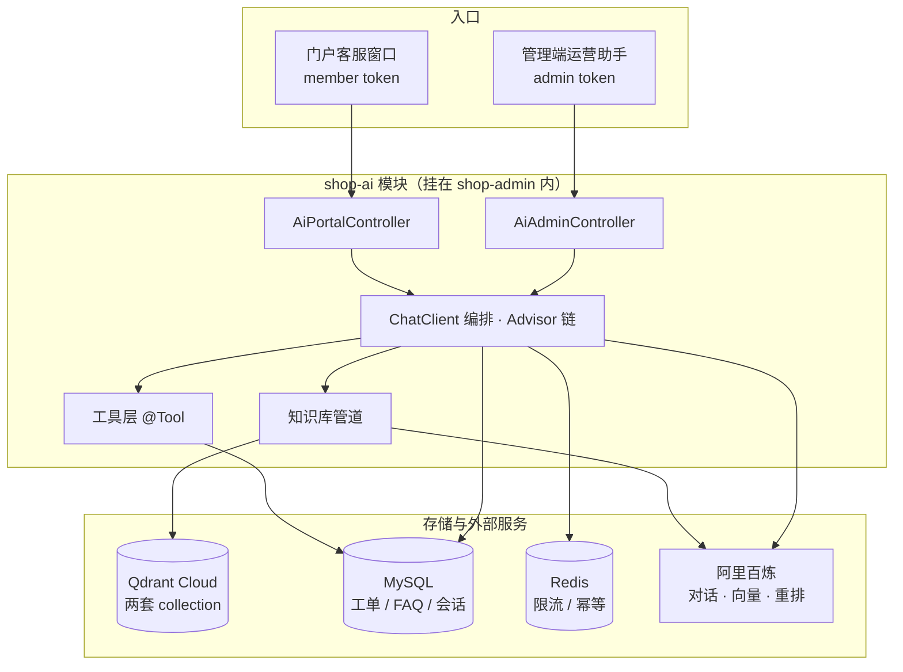

# AI 智能客服落地方案

给商城接一个 AI 客服：买家在门户问订单、物流、售后和政策，运营在管理端查经营数据、生成文案。技术栈 Spring AI + Qdrant + 阿里百炼，分 P0、P1、P2 三批落地。

## 结论

有几条判断先定下来，后面的安排都建立在这些上面。

版本必须按官方对应表锁死。项目是 Spring Boot 3.4.5，对应 Spring AI Alibaba 的 1.0.x 系列、Spring AI 1.0.0。SAA 用四位版本号，前三位跟 Spring AI 主版本走、第四位是社区补丁；1.0.x 与 1.1.x 的核心接口不兼容，混用不会在编译期报错，而是到运行期才炸成类找不到或方法签名不匹配。

rerank 模型要换新名字。百炼的 `gte-rerank-v2` 已按官方公告在 2026 年 5 月下线，现在用 `qwen3-rerank`。网上大量教程和示例代码还写着旧名字，照抄会直接报模型不存在。

知识与规则进向量库，状态与事实走工具调用。订单、物流、库存这类实时数据不进 Qdrant，由 Function Calling 查 MySQL。这是整套设计里最容易做错的一处，详见「数据分工」。

最大的不确定性是召回质量，不是代码量。商品标题普遍很短、参数是结构化字段，向量化之后能不能被一句自然语言问句命中，只能拿真实数据实测。P0 的第一件事就是这个，不合格就得回头调切分和文本组装策略，而不是继续往上堆功能。

最大的人力成本在知识库内容。项目里目前没有成文的退换货、运费、发票、会员权益文档，这些规则只散落在代码行为和操作习惯里，需要先梳理成文，这一步技术替代不了。

## 接入前的现状

| 事项 | 现状 | 对方案的影响 |
| --- | --- | --- |
| 后端框架 | Spring Boot 3.4.5 / Java 21 / Maven 聚合多模块 | 满足 Spring AI 1.0.x 要求，不必升级 |
| AI 依赖 | 全仓库没有 | 从零引入 |
| HTTP 客户端 | 只有 JDK `HttpClient`（微信支付用） | Spring AI 内部用 WebClient，会带进 reactor-netty；与 servlet MVC 可共存，但不要顺手加 `spring-boot-starter-webflux`，它会和 MVC 抢自动配置 |
| 向量库 | 没有，也没有 Elasticsearch | 用 Qdrant Cloud 托管集群（与账号下既有集群共用，靠 collection 隔离），本地不自建 |
| 门户鉴权 | localStorage 存 member token，请求头带 `Bearer` | AI 模块直接复用现有过滤器 |
| 管理端鉴权 | `AdminTokenStore`，与会员体系完全独立 | 两个入口分别校验，不能混用 |
| 门户客服入口 | 没有，只有首页一行「客服专线」文本 | 需新增悬浮客服窗口 |
| FAQ 数据 | 没有对应表 | 新建 `ai_faq` |
| 系统配置 | `sys_config` 是强类型单 JSON 列，字段固定 | 不适合存模型 API Key，Key 走环境变量 |

## 版本与依赖

### 版本对应

SAA 的官方对应关系：

| Spring AI Alibaba | Spring AI | Spring Boot |
| --- | --- | --- |
| 1.0.0.4 | 1.0.0 | 3.4.x |
| 1.1.0.0 | 1.1.0 | 3.4.x |
| 1.1.2.3 | 1.1.2 | 3.5.x |

本项目固定用 **SAA 1.0.0.4 + Spring AI 1.0.0**，父 pom 的 3.4.5 不动。1.0.0.4 的 pom 里声明了 `spring-boot-starter:3.4.8`，不必理会——`spring-boot-starter-parent` 的 `dependencyManagement` 优先级高于传递依赖，实际解析出来仍是 3.4.5。

另一条路是先升 Spring Boot 到 3.5.x，换用 SAA 1.1.2.3，能拿到最新能力与修复。代价是动了全项目基线，而且 1.0 到 1.1 的 `ChatClient`、Agent 相关接口有破坏性变更。当前需要的只是对话、向量、重排三项，用不上多智能体，所以不升。

需要注意 1.0.x 系列已经很久没有功能更新（1.0.0.4 发布于 2025 年 9 月）。仓库里另有 `1.0.0.3-20260305-cve` 这类定向补丁分支，选型落地前到 Maven Central 核对一次目标版本的发布说明，确认是否含所需的安全修复。

如果 1.0.0.4 在 3.4.5 上出现与 Spring 版本相关的运行期异常，退到官方对应表中标注 3.4.5 的 1.0.0.2，两者在 API 层面一致。

### 依赖声明

`shop-admin/pom.xml` 的 `properties` 加两项：

```xml
<spring-ai.version>1.0.0</spring-ai.version>
<spring-ai-alibaba.version>1.0.0.4</spring-ai-alibaba.version>
```

`dependencyManagement` 里导入两个 BOM，用 BOM 管版本比手工指定每个 artifact 稳妥：

```xml
<dependency>
    <groupId>org.springframework.ai</groupId>
    <artifactId>spring-ai-bom</artifactId>
    <version>${spring-ai.version}</version>
    <type>pom</type>
    <scope>import</scope>
</dependency>
<dependency>
    <groupId>com.alibaba.cloud.ai</groupId>
    <artifactId>spring-ai-alibaba-bom</artifactId>
    <version>${spring-ai-alibaba.version}</version>
    <type>pom</type>
    <scope>import</scope>
</dependency>
```

新模块声明的依赖：

| 坐标 | 用途 |
| --- | --- |
| `com.alibaba.cloud.ai:spring-ai-alibaba-starter-dashscope` | 一个依赖同时提供对话模型、向量模型、重排模型 |
| `org.springframework.ai:spring-ai-starter-vector-store-qdrant` | Qdrant 向量库接入与自动配置 |
| `org.springframework.ai:spring-ai-starter-model-chat-memory-repository-jdbc` | 会话记忆的 JDBC 实现（本项目改为自实现，见下） |

不引 `spring-ai-alibaba-graph-core`、不做多智能体编排；不引 Elasticsearch 相关组件做混合检索，P0 阶段向量召回加 Rerank 已经够用。

### Qdrant

用 Qdrant Cloud 托管集群，不自建，`docker-compose.yml` 不加服务。本地开发也连云端，避免开发机与线上出现版本和参数差异。

集群归属。**Free 层每个账号只允许一个集群**，这个账号的名额已被 `imageagent` 占用，所以本项目与之共用这一个实例，隔离靠 collection 而不是靠实例。控制台里 `Create Cluster` 直接指向 `?template=standard`，强制访问 `?template=free` 或不带参数都会重定向回 Standard，Billing 页也显示从未产生用量、未绑卡——这是"免费额度已用掉"的表现，不是入口藏起来了。要拿到独立实例只有三条路：删掉 `imageagent` 重建、另注册一个账号（仍是 Free）、或开 Standard（最小配置 2 GiB / 0.5 vCPU / 8 GiB，Tokyo 约 $33.57 每月）。当前选择共用，代价记在「风险」一节。

规格与量级。免费层是单节点 1 GB 内存 / 0.5 vCPU / 4 GB 磁盘，官方口径可承载约 100 万个 768 维向量。本项目全部入库内容（约 400 个商品 + FAQ + 政策文档切片）按 1024 维算不到 1 万个向量，容量绰绰有余——**约束不在容量，在可用性**：

- 免费层集群闲置 1 周自动暂停，暂停期间 API 不响应，需要在控制台手动唤醒（约 30~60 秒恢复，数据不丢）
- 闲置满 4 周未激活会被删除
- 免费层无 SLA、单节点、无自动备份，快照只能通过 API 手动做

所以开发与验证阶段 Free 够用，**正式上线要切到 Standard**。否则客服接口会在无人使用一周后直接不可用，而这段时间恰好是上线冷启动期。

连接参数。集群在 443 与 6333（REST）、6334（gRPC）上可访问，Spring AI 走 gRPC。

Qdrant 的 client 与门户、管理端两个 VectorStore 都由 `AiConfiguration` 自建，不用 Spring AI 官方的自动配置——官方那份只支持单个 collection，而且它的条件是 `@ConditionalOnProperty(name="spring.ai.vectorstore.type", havingValue="qdrant", matchIfMissing=true)`：**只要 qdrant starter 在 classpath 上，不写这个属性它照样会激活**，并要求必须存在 `EmbeddingModel`。AI 关闭时没有该 Bean，应用会直接启动失败（`Parameter 0 of method vectorStore ... required a bean of type 'EmbeddingModel'`）。所以配置里显式把它关掉：

```yaml
spring:
  ai:
    vectorstore:
      type: none
```

`shop.ai.qdrant.*` 里的取值口径：`host` 只填主机名，控制台给的接入地址是完整 URL（`https://xxx.cloud.qdrant.io:6334`），整串填进去连不上；`use-tls` 云集群必须为 true（本机自建才是 false）。两个 VectorStore 都用 `initializeSchema(false)` 构建，collection 手工预建，理由见「模型选型」；启动时加一次连通性自检，连不上集群直接打明确日志，别等到买家提问才暴露。

API Key 用 database 级的 key，不用集群全域 key；与百炼的 Key 一样走环境变量，不进仓库。

不区分 dev 与 prod，两个 collection 名不带环境前缀，本地也连这一套。代价是本地跑全量重建会直接作用到线上数据——重建会先删 collection，所以脚本里必须加一道显式确认（打印目标 collection 与当前 `points_count`，不带 `--force` 就退出），别让它变成一条能顺手执行掉的命令。

出网与降级。后端所在网络要能访问 `*.cloud.qdrant.io:6334`，部署在内网需在安全组或代理上放通。这是硬依赖，连不上时应降级到纯 FAQ 与转人工，不能让整个对话接口 500。

备份。Qdrant 不作为唯一数据源：向量的源数据在 MySQL（商品、`ai_faq`、`ai_document`），随时可以重新向量化，所以不依赖 Qdrant 的快照能力。真正需要常规备份的是 MySQL 里那几张 `ai_` 表。

### 已经建好的部分（2026-09-21）

现有 free 集群 `imageagent` 已建两个 collection，都是 1024 维、Cosine、**匿名向量**（vector 字段名为空串）——与 Spring AI 的默认取值一致，因此不需要配 `vectorName`。集群坐标：

```
cluster id: feccbe99-c29d-4352-80c3-9307752d44b5
endpoint:   https://feccbe99-c29d-4352-80c3-9307752d44b5.sa-east-1-0.aws.cloud.qdrant.io
region:     sa-east-1（AWS 圣保罗）
```

该集群里另有 `image`、`library_documents`、`text` 三个 collection，属于别的应用；除 `library_documents` 有 14 个点外都是空的。1 GiB 内存与 4 GiB 磁盘是这几个应用共用的。

| collection | 向量 | payload 索引 |
| --- | --- | --- |
| `shop_knowledge_portal` | 匿名 / 1024 / Cosine | `source_type` keyword、`category_code` keyword、`enabled` bool |
| `shop_knowledge_admin` | 匿名 / 1024 / Cosine | 同上 |

建的过程中暴露三件只有动手才会知道的事：

**strict mode 默认是开的。** 集群的 `strict_mode_config` 默认 `enabled: true`，其中 `unindexed_filtering_retrieve: false` 意味着**拿未建索引的字段做过滤会被服务端直接拒绝**——不是忽略、也不是慢，是报错。所以 payload 索引不是性能优化，是过滤检索的前置条件：代码里任何出现在 `filter` 中的字段都必须先建索引，否则类目过滤一上线就报错。

**布尔字段过滤不了。** 上面那张表里 `enabled` 建的是 bool 索引，但 Spring AI 的 Qdrant 过滤器转换器只接受字符串与数字，`eq("enabled", true)` 会抛 `Invalid value type for EQ. Can either be a string or Number`。它抛在本地，又被检索层的兜底 catch 吞成空结果，对外表现只是「没命中」——和知识库没灌数据的症状一模一样。所以过滤条件里只用 keyword 字段（`category_code`），`enabled` 留在 payload 里但不参与过滤：停用知识靠同步末尾的 `removeStaleVectors()` 直接删掉向量点，那才是真正生效的机制。

**闲置暂停确实会发生。** 这次该集群正处于 SUSPENDED（Free 层闲置一周被自动暂停），在控制台 Reactivate 后约一分钟恢复 HEALTHY，数据完好。前面那段不是理论风险，是实测。

`sa-east-1` 在南美。国内访问该区域的往返延迟明显高于亚太节点，开发期无所谓；如果线上部署也连这里，每次检索的延迟会叠加进首字延迟，上线前值得考虑迁到更近的 region（Free 层只允许一个集群，迁移意味着新建集群并重跑向量化）。

### 不要用内置的 JdbcChatMemoryRepository

Spring AI 内置的 `JdbcChatMemoryRepository` 用起来最省事，但它有一处硬限制：**不支持工具调用消息**。官方原话是含 tool calls 的 `AssistantMessage` 和 `ToolResponseMessage` 在保存时被静默过滤，读回来也没有。

这直接影响 P1——工具调用一旦上线，会话历史里就会出现消息缺口，多轮对话中「我查的那个订单」这类指代会解析失败，而且这种失败没有任何报错，直到用户投诉才会发现。

所以会话存储改为自实现 `ChatMemoryRepository`，落到自己的 `ai_message` 表。这样一次解决三件事：不受内置实现的消息类型限制、会话记录本身就是管理端要展示的内容（不用存两份）、字段可以按业务需要加（token 用量、模型名、工具名）。

## 模型选型

| 用途 | 模型 | 说明 |
| --- | --- | --- |
| 对话 | `qwen-plus` | 客服场景的性价比档；复杂问题可切 `qwen-max`，做成可配置 |
| 向量 | `text-embedding-v4` | 维度选 **1024**（该模型支持 2048/1536/1024/768/512/256/128/64） |
| 重排 | `qwen3-rerank` | 替代已下线的 `gte-rerank-v2` |

两条会在实施时才暴露的约束：

`text-embedding-v4` 单次请求最多 **10 条**输入，单行最长 8192 token。批量向量化商品时如果不做分批，一次提交几百条会被直接拒绝。

模型名要能在百炼控制台的模型广场实际开通。文档里给的是写这份方案时的可用项，落地时以控制台为准；`qwen3-rerank` 这类新模型需要在控制台确认已开通，否则调用会报模型不存在。

Qdrant 的 collection 必须**预先建**，不要依赖自动创建。`spring-ai-starter-vector-store-qdrant` 会按 `EmbeddingModel` 的维度自动建 collection 并用 Cosine 距离，但维度一旦定死就不能改——换 embedding 模型或改维度，整个 collection 要重建并重跑全量向量化。手工先建好写在脚本里，比让框架偷偷决定要可靠。

```
维度 1024，距离 Cosine
collection: shop_knowledge_portal   # 门户公开知识
collection: shop_knowledge_admin    # 管理端内部知识
```

建的时候顺手给需要过滤的 payload 字段建索引（`source_type`、`category_code`、`enabled` 这类）。Qdrant 是先过滤后检索，没索引的字段在大 collection 上会退化成全量扫描。命名上加环境前缀区分 dev 与 prod，见上文「Qdrant」。

## 架构

### 两个入口、一个底座、三处硬隔离

门户客服与运营助手共用 Spring AI 配置、共用 Qdrant 实例、共用编排层，但有三样东西不能共用：

| 隔离项 | 做法 | 原因 |
| --- | --- | --- |
| 鉴权主体 | 两个 Controller，分别走 member 与 admin 的现有过滤器 | 两套令牌体系互不认，且「当前是谁」决定了工具能查哪些数据 |
| 向量 collection | `shop_knowledge_portal` 与 `shop_knowledge_admin` 物理分开 | 靠 payload 过滤是单点失误即泄露；两个 collection 结构上不可能串 |
| 会话与记忆 | 不同表分区（`channel` 字段），记忆按 conversationId 隔离 | 混用会出现运营助手读到买家对话 |



新增模块 `shop-ai`，挂进 `shop-admin` 的 `<modules>`，位置排在业务模块之后、`shop-boot` 之前。它依赖 `shop-common`、`shop-identity`、`shop-catalog`、`shop-trade`、`shop-marketing`、`shop-reporting`，对外只暴露接口。不另起服务：跨服务调用在这套单体多模块里只会带来鉴权上下文传递和分布式事务的额外麻烦，而现有约定也是业务能力都在 `shop-admin` 内实现。

### 数据分工

这是整套设计的地基，说清楚为什么。

订单、物流、库存、优惠券余额这些是**状态**，它们的正确答案只有一个，且随时在变。向量召回是相似度匹配，不是精确查询：买家问「我上个月那单」，向量库可能召回三条别人的相似订单描述，而真正的那条排在第 8 位。就算排对了，商品物流状态一天变五次，向量化追不上，每天重新嵌入一遍也不现实。最要紧的是，检索错了没法自证——拿不出确定的那一行来对质。

政策、规则、FAQ、商品卖点是**知识**，内容稳定、允许模糊匹配、更新频率低，天生适合放进向量库。

所以：

- 知识走 RAG：`text-embedding-v4` 向量化 → Qdrant 召回 top-20 → `qwen3-rerank` 精排取 top-5 → 拼进上下文
- 状态走工具：模型返回工具调用意图 → 后端用**当前登录身份**查 MySQL → 真实数据回填给模型

模型在这条链路里的角色被刻意限制为**组织语言**，不负责**提供事实**。系统提示里必须写死这条约束：没有工具返回的数据，不许说时效、不许说金额、不许说赔付。大模型天然倾向于补全，给它半截物流轨迹，它会自己编一个「预计明天送达」，这类幻觉在客服场景是投诉来源。

顺带一条同源约束：门户的 collection 里只放公开知识，任何含买家隐私的数据都不许灌进去。这也是两个 collection 物理分开的另一个理由。

### 请求链路

一次典型提问「我那个订单到哪了」的处理顺序：

1. 鉴权，从令牌上下文取当前身份，装载会话历史
2. 多轮改写：带指代的问题用模型重写成自包含的完整问题（「订单 20260915003 的物流状态」）。这一步不能省，少了它多轮对话到第三轮就崩
3. 意图分流：事实类走工具调用，知识类走向量检索
4. 上下文拼装：系统提示 + 实时数据 + 知识片段 + 对话历史
5. 模型流式生成
6. 合规过滤：拦截不承诺时效、价格、赔付的表述
7. SSE 流式返回；置信度不足则落工单并给出转人工入口

## 数据模型

新增表统一用 `ai_` 前缀，遵循现有 `sys_` / `catalog_` / `trade_` / `member_` / `marketing_` / `content_` 的命名约定，并补齐索引、唯一约束、逻辑删除字段。

| 表 | 用途 | 关键字段 |
| --- | --- | --- |
| `ai_faq` | 常见问题与答案，运营可维护 | question、answer、category、keywords、sort、enabled |
| `ai_conversation` | 会话主表 | conversation_id（唯一）、channel（portal/admin）、subject_type、subject_id、title、message_count、last_message_at、status |
| `ai_message` | 消息明细，同时作为 ChatMemory 的存储 | conversation_id、sequence、role（user/assistant/tool/system）、content、tool_name、tool_payload、model、tokens_in、tokens_out |
| `ai_ticket` | 转人工工单 | ticket_no（唯一）、conversation_id、member_id、contact、question、ai_summary、status（pending/processing/closed）、handler_id、handled_at |
| `ai_document` | 知识文档（P2） | title、doc_type、source、version、status（draft/indexed/failed）、chunk_count、indexed_at |
| `ai_vector_sync` | 向量同步位点与失败重试 | source_type（product/faq）、source_id、content_hash、status、retry_count、synced_at |

`ai_message` 的 `sequence` 是消息在同一会话内的顺序号，`JdbcChatMemoryRepository` 也用这个思路保证读回来的顺序正确，自实现时照做。

`ai_vector_sync` 的 `content_hash` 用于增量同步：商品文本内容没变就不重复调用 embedding，省额度也省时间。

## P0：把知识库和对话跑通

目标是一个能答对问题的客服，还不会查数据。

**基础设施**

- Qdrant 侧已完成（2026-09-21）：两个 collection 与 payload 索引均已建好，本阶段只需接配置并验证连通性，见「已经建好的部分」
- 新增 `shop-ai` 模块，接进 `shop-admin/pom.xml`
- 百炼与 Qdrant 配置进 `application-dev.yml` 与 `application-prod.yml`。dev 配置已在 `.gitignore` 中排除，本地可直接填真实值（注意该文件此前被 Git 跟踪，仅在 `.gitignore` 加规则不生效，需先 `git rm --cached` 再提交）；prod 配置只声明 `${环境变量}`，不留默认值
- `.env.example` 补 `SHOP_DASHSCOPE_API_KEY`、`SHOP_QDRANT_HOST`、`SHOP_QDRANT_API_KEY`、`SHOP_QDRANT_COLLECTION`、三个模型名、`SHOP_AI_ENABLED` 开关

**知识库管道**

- 建 `ai_faq` 表与后台维护接口
- 商品向量化：从 `shop-catalog` 读商品，组装成可检索文本，调 `text-embedding-v4`，写 Qdrant。文本组装是这里的关键——标题、类目路径、卖点、关键参数拼成一段自然语言，不是把整行 JSON 丢进去。组装得不好，后面的召回一定差
- 按 10 条一批提交，带失败重试与限速
- 增量同步：`content_hash` 没变就跳过

**对话链路**

- `ChatClient` + Advisor 链
- 自实现 `ChatMemoryRepository`，落 `ai_message`
- SSE 流式输出
- 会话落 `ai_conversation` / `ai_message`

**兜底与转人工**

- 建 `ai_ticket`，答不了时落工单并给出联系方式
- 管理端新增「客服工单」页（列表 + 详情 + 标记处理），复用现有列表页模式
- 门户新增悬浮客服窗口

**验收口径**

- 准备 10 条自然语言商品问句，前 3 召回至少 7 条人工判断为相关。这一关不过就停下调组装策略，不要往下做
- 10 条政策问题，答案与文档一致，不出现编造
- 问一个知识库里确实没有的问题，要落成工单，不能编答案
- 流式输出首字延迟在 2 秒内，长回答不截断
- 未登录状态提问能正常对话，不报错

召回质量这一关是 P0 的决策点，也是最可能推翻方案的地方。真到那一步，可选的调整有：改文本组装方式、换 1536 或 2048 维、加关键词检索做混合召回。三条都试过仍不合格，才需要考虑引入 Elasticsearch 做混合检索，那是另一件事。

## P1：让客服能查订单

目标是客服从「能聊」变成「能办事」。

**工具层**

| 工具 | 数据来源 |
| --- | --- |
| 查会员订单列表 | `shop-trade` |
| 查订单详情与物流轨迹 | `shop-trade` + `shop-integration` 快递 100 |
| 查售后进度 | `shop-trade` |
| 查可用优惠券 | `shop-marketing` |

**越权校验**

这是 P1 里最不能省的一步。工具签名里不出现身份参数，当前会员身份由服务端注入，不从模型给的参数里取，查询条件带上归属校验。

项目里已有 `MemberPrincipalResolver.requireMemberId(Authentication)`（`shop-identity`），门户控制器就是这么取当前会员的。但工具回调和控制器不完全一样：Spring Security 的上下文默认存在 ThreadLocal，流式对话底层走 Reactor，工具回调不一定还在原来的请求线程上，直接用 `SecurityContextHolder` 可能取不到认证信息。做法是在构造对话请求时就把会员身份显式传进工具上下文，工具从上下文里读，不依赖线程。

```java
// 身份由服务端注入工具上下文，不作为模型可见的参数
@Tool(description = "查询当前登录会员的订单物流")
OrderLogistics queryMyOrderLogistics(String orderNo, ToolContext ctx) {
    Long memberId = currentMemberId(ctx);
    return tradeQueryService.findOrderForMember(orderNo, memberId);
}
```

如果写成 `queryOrder(orderNo)` 直接查库返回，等于开放了一个查询任意订单的接口——别人问你的订单号就能拿到收货地址和手机号。这条一旦在生产上被试探过一次，就已经泄露了。

**其余**

- 多轮改写（指代消解）
- 引用溯源：回答带上知识来源，让买家知道答案出自哪条政策
- 合规过滤：时效、价格、赔付类表述拦截
- 限流：门户接口按会员维度限流，用现有 Redis；设置单次对话 max tokens 与最大轮数

**验收口径**

- 登录态问「我的订单到哪了」，返回该会员自己的订单与真实物流轨迹
- 用另一个会员的订单号提问，必须答「查不到」，不能返回任何信息
- 未登录问订单，引导登录，不报错也不编造
- 多轮：上一轮提到过订单号，下一轮问「它到哪了」能正确解析
- 抽查 20 条追问时效的回答，不出现承诺性表述

## P2：管理端助手与运营工具

**管理端运营助手**

复用编排层，独立鉴权与 collection。工具接 `shop-reporting` 与 `shop-payment`：查销售指标、商品动销、资金流水，解释报表口径。

能力边界要在做之前定清楚。一个什么都能问的万能框，最后通常什么都答不好。建议先收敛到「查经营指标 + 解释指标口径 + 生成运营文案」三类，其余需求等用出规律再加。

**知识库运营界面**

- FAQ 增删改查（复用 P0 的表，补界面）
- 文档上传、切分预览、重新索引、召回测试（在界面上直接试一句问句，看召回结果）
- `ai_document` / `ai_vector_sync` 的状态展示与失败重试

召回测试这一项的实际价值高于其余几项——它是知识库维护者判断「改了之后有没有变好」的唯一手段。

**效果评估**

- 会话记录的检索与回溯
- 未命中问题聚类：把落成工单的问题定期归并，反推知识缺口
- 满意度采集：对话结束后的简单评价

**验收口径**

- 门户侧问经营数据（如「上个月销售额」）必须答不出来
- 管理端问同一句能答出，且数字与报表页一致
- 改一条 FAQ 后重新索引，相关问答的结果随之变化
- 运营助手对超出边界的提问给出明确的能力说明，不是硬答

## 需要先确认的事

百炼账号与 API Key。需要在百炼控制台开通服务、创建 API Key，并确认 `qwen-plus`、`text-embedding-v4`、`qwen3-rerank` 三个模型都已开通。

Qdrant API Key。集群与两个 collection 已就绪，坐标见「已经建好的部分」；只差一个 database 级 API Key（不用集群全域 key）。密钥走本机环境变量，不进仓库、不贴聊天。

知识库内容的来源。退换货规则、运费标准、发票流程、会员权益这几类政策，目前没有成文文档。要么先梳理成 Word/Markdown 再入库，要么第一版只做商品问答，政策类等文档就位再补。

客服窗口的入口形态。门户目前没有任何客服入口，需要定：悬浮按钮常驻还是只在部分页面出现、是否带未读提示、移动端怎么呈现。

工单的处理流程。`ai_ticket` 谁能看、谁负责处理、处理完的状态流转，以及是否需要通知（现有站内通知与邮件可以复用）。

## 风险与已知坑

| 事项 | 说明 | 应对 |
| --- | --- | --- |
| 版本混用 | 1.0.x 与 1.1.x 接口不兼容，编译期不报错 | 用 BOM 统一管理，两个 BOM 都显式声明版本 |
| rerank 模型名 | `gte-rerank-v2` 已下线，示例代码多为旧名 | 用 `qwen3-rerank`，落地前在控制台确认已开通 |
| embedding 批量上限 | 单次最多 10 条 | 分批提交 + 失败重试 |
| 维度定死 | collection 维度不可改，改要重建并重跑全量 | 预先手工建 collection，维度写进脚本 |
| 会话消息缺口 | 内置 JDBC 会话存储静默丢弃工具调用消息 | 自实现 ChatMemoryRepository |
| 召回质量不达标 | 商品文本短、参数结构化 | P0 设决策点，三条调整方案，全不过再考虑混合检索 |
| 幻觉 | 模型会自行补全时效、金额 | 系统提示硬约束 + 工具返回才可引用 + 输出侧合规过滤 |
| 成本失控 | 每次调用都产生费用 | 门户接口按会员限流、单次 max tokens 上限、会话轮数上限 |
| API Key 明文 | `sys_config` 不适合存密钥 | 走环境变量，管理端只放模型名、温度、topK 这类非敏感项 |
| 与其它应用共集群 | 同一实例里还有别的应用的 collection，共享 1 GiB 内存与 4 GiB 磁盘；配额、误删、闲置暂停互相牵连——集群被自动暂停时，本项目的检索也一起不可用 | 上线前迁到独立实例；迁移代价仅重跑向量化，源数据在 MySQL |
| 集群闲置暂停 | Free 层闲置 1 周自动暂停、4 周删除，暂停期间接口不响应 | 上线前切 Standard；暂留 Free 则加保活任务与降级 |
| 向量库不可达 | 后端到 Qdrant Cloud 的出网是硬依赖 | 启动自检 + 对话链路降级到纯 FAQ 与转人工 |
| 端点配置写错 | `host` 混入 `https://` 与端口、`use-tls` 未打开，都是运行期才报错 | 配置模板固定写法，启动自检覆盖连通性 |

## 明确不做的部分

第一版不做，不是不重要，是优先级排后：

- 让模型生成 SQL 直接查库
- 多智能体编排
- 售前个性化推荐（推荐质量不可验证，做砸了用户不会反馈）
- 语音客服
- 把对话历史当知识库存进 Qdrant
- 知识库内容还没成型就先做知识库运营界面
